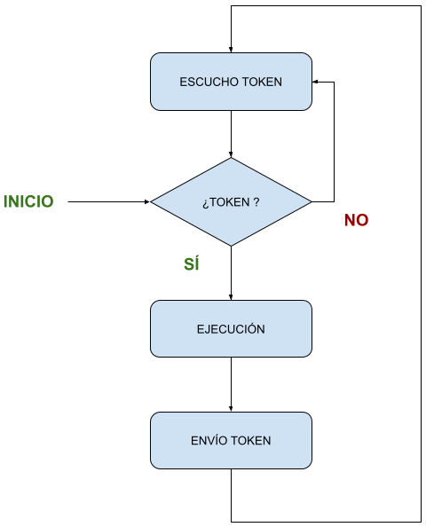

# UA3 - Actividad Evaluable
## 14/12/2022

Vamos a simular el comportamiento de una red [TOKEN RING](https://es.wikipedia.org/wiki/Token_Ring) con, inicialmente, 3 miembros en dicha red.

Para ello, crea un programa que usando sockets UDP se vayan pasando el TOKEN al siguiente miembro de la "red", para obtener el permiso de ejecución.

Cada miembro de dicha red debe esperar a recibir por un puerto en concreto el TOKEN.  Una vez recibido hará uso de la "red", o del "recurso", o ejecutará el algoritmo indicado.  Cuando termine su trabajo, enviará el TOKEN al siguiente miembro de la "red".

* Miembro 1:
  * Puerto Escucha: 10000
  * Tarea a realizar: esperar 1 segundos
* Miembro 2:
  * Puerto Escucha: 10001
  * Tarea a realizar: esperar 2 segundos
* Miembro 3:
  * Puerto Escucha: 10002
  * Tarea a realizar: esperar 3 segundos

Para simplificar, consideraremos el TOKEN como una sencilla variable booleana.  Su valor será TRUE cuando se reciba, y por tanto esté en posesión del TOKEN, y FALSE en caso contrario.

Consideraremos también, por simplificar que cuando se reciba algo por el puerto correspondiente, simplemente es el TOKEN que esperamos recibir.

Debes implementar la clase *MiembroToken* que recibirá como

Cada miembro de la red sabe que debe enviar el TOKEN al siguiente puerto en el que uno mismo escucha o espera recibir el TOKEN.

Todos los miembros de la red saben que el primer miembro de la red escucha en el puerto 10000.

Cuando un miembro de la red reciba el TOKEN se debe poder calcular el tiempo que transcurrió desde que lo recibió la vez anterior.

El funcionamiento de un miembro de la red token ring queda reflejado en el siguiente diagrama de flujo:



Parámetros obligatorios al ejecutar por línea de comandos:

- **[id]**: indica el número de segundos que debe "dormir" el *MiembroToken*
- **[puerto]**: puerto por el que espero recibir el token.  Enviaré el token al siguiente *MiembroToken* por el puerto+1. Si el puerto es el 10000 sé que soy el primer *MiembroToken*.
- **[token_al_inicio]**: variable que indicará si tengo el token al iniciar el programa
- **[soy_el_ultimo]**: si está activada, en lugar de enviar el token al puerto siguiente (puerto+1) lo enviaré al primer *MiembroToken* (puerto 10000).

El programa/clase *MiembroToken* debe ejecutarse así:

```
java MiembroToken [id] [puerto] [token_al_inicio] [soy_el_ultimo]
```

Ejemplos de llamadas correctas para ejecutar los 3 miembros de la red:

```
C:\Users\daniel\DEVELOPMENT\psp-22-23>java MiembroToken 1 10000 yes no

C:\Users\daniel\DEVELOPMENT\psp-22-23>java MiembroToken 2 10001 no no

C:\Users\daniel\DEVELOPMENT\psp-22-23>java MiembroToken 3 10002 no yes

```

Una vez comprendido el funcionamiento, detalles específicos a implementar:

* **FR1 [5 puntos]**: Implementa la clase *MiembroToken* con TODA la funcionalidad descrita previamente.  Para comprobar la correcta ejecución del sistema, la clase *MiembroToken* debe imprimir por pantalla la suficiente información para ver el estado de cada Miembro de la red.
* **FR2 [2,5 puntos]**: Mejora la clase *MiembroToken* para poder ejecutar su funcionalidad, en este caso, dormir una cantidad de tiempo determinada, como un HILO.
* **FR3 [1 punto]**: Desarrolla una solución (un script de bash, otro programa en java, ...) para lanzar un número determinado de miembros a ejecutar, por ejemplo 5, 15, 200, ...
* **FR4 [1 punto]**: Mejora la clase MiembroToken para crear una red token ring de anillo doble, es decir, se puede tener otro token en otro anillo virtual, en sentido contrario.


### Notas

* Se trabajará en equipos de hasta 4 miembros.  Tratad de repartir las tareas y organizaros sobre la marcha.  Podéis aprovechar para iniciaros en el [pair programming](https://en.wikipedia.org/wiki/Pair_programming).

* Las instrucciones de entrega no cambian su esencia, simplemente, la carpeta de trabajo en este caso será *team_X* en lugar de *dev_X*. Podéis mirar la carpeta *team_0* como referencia.  NO LA BORRÉIS.

```
psp-22-23\UA3\actividad\team_X
```

* TOD@S los miembros del grupo deben subir el trabajo completo a su correspondiente rama.

* Esta actividad sumará *(0,1 * puntuación)* puntos directamente a todos los miembros del grupo en esta unidad de aprendizaje.  Ese punto puede suponer la vida o la muerte para algn@s.

* No responderé, ESTA VEZ DE VERDAD, a ninguna pregunta una vez pasados 10 minutos de clase. Palabrita.

* Sí, he subido ya la actividad al repositorio, ¿qué pasa?... a ver qué me encuentro mañana ;-)

### Recomendaciones

* Leed el enunciado con **tranquilidad**.  Es parte de vuestro futuro y cercano trabajo, saber obtener información de un documento y plasmarla, en este caso, en un programa informático.

* Es un trabajo en **EQUIPO**.  Hablad.  Escuchad. Como personas. Respetad los tiempos de cada miembro del equipo. **TOD@S** tenéis capacidad de aportar.

* No hagáis paquetes de trabajo si no los domináis.  Simplemente ejecutad vuestra clase principal como en los ejemplos.  Para ello tenéis el fichero ya iniciado *MiembroToken.java*.

* Es (más que) probable, que haya que utilizar variables auxiliares, métodos ya vistos o usados en los ejemplos, stackoverflow, ... para resolver los pequeños problemas en los que se debe descomponer el problema general.